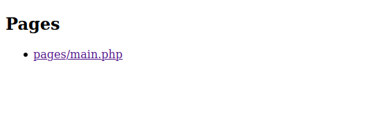

# Capítulo 1. Creando un nuevo proyecto.

En el presente capítulo abordaremos de forma práctica la manera de crear un proyecto ComposedViews basado de la popular plantilla de administración [AdminLTE](https://adminlte.io/). Hemos decidido escoger dicha plantilla dado que entre otras bondades la misma ofrece una [página básica](https://adminlte.io/themes/AdminLTE/starter.html) la cual nos servirá para mostrar de forma clara los conceptos que se deben tener en cuenta sobre ComposedViews.

Una vez finalizado dicho capítulo habremos construido un proyecto PHP instalable por [Composer][Composer] el cual contendrá clases cuyas instancias serán capaces de generar el código HTML de la página así como de sus componentes. Además de ello, el proyecto contendrá los recursos de la maqueta los cuales estarán correctamente referenciados desde el HTML generado y además podrán ser instalados en cualquier aplicación PHP con solo ejecutar un comando.

>En [este enlace](#) se puede encontrar el proyecto realizado en el capítulo.

## 1. Consideraciones sobre los proyectos.

Un proyecto ComposedViews es un paquete [Composer][Composer] de tipo `then-package`. A los paquetes de este tipo se les define como *then packages* y se gestionan además con la herramienta [ThenLabs CLI](https://github.com/thenlabs/cli).

Es importante que lea la documentación de esta herramienta dado que en la misma se define más profundamente lo que es un *then package* entre otros conceptos adicionales que necesitará conocer para la comprensión de esta guía.

## 2. Creando el nuevo proyecto.

Ejecute el siguiente comando:

    $ composer create-project thenlabs/kit-template composed-admin-lte dev-master

>Puede sustituir `composed-admin-lte` por el nombre del directorio donde desea crear su proyecto.

En determinado momento [Composer][Composer] le preguntará si desea eliminar el repositorio actual. Recomendamos que inique sí ya que no tiene ningún sentido que su proyecto contenga esos *commits*. Este paso será automatizado en futuras versiones.

Se le preguntará además sobre ciertos datos del proyecto donde podrá especificar los valores que desee **excepto en el tipo y las dependencias donde deberá mantener los valores por defecto**.

## 3. Conociendo la estructura del proyecto.

Una vez que se ha creado el proyecto podremos encontrar la siguiente estructura de archivos dentro del directorio del mismo.

```
├── assets/
├── composer.json
├── composer.lock
├── examples/
│   ├── index.php
│   ├── pages/
│   │   └── main.php
│   └── then.json
├── README.md
├── serve
├── src/
├── tests/
└── then-package.json
```

[Composer]: https://getcomposer.org/

Como se puede suponer, en el directorio `assets` se deberán almacenar todos los recursos web de las vistas a los que popularmente se les conoce como *assets*.

Dado que las vistas son elementos apreciables visualmente, se hace necesario que estos proyectos contengan páginas de ejemplos con el objetivo de que cuenten con algún mecanismo de visualización.

Teniendo en cuenta además, que a medida que se van llevando a cabo los desarrollos de las vistas se necesita ir visualizando sus resultados, existe una funcionalidad que permite servir en una URL local todas las páginas de ejemplos del proyecto. Para iniciar esta funcionalidad se debe ejecutar el siguiente comando:

    $ php serve

De esta manera se habrá iniciado la siguiente aplicación web en la dirección http://localhost:8080.



>Si por algún motivo necesita ejecutar la aplicación en otra dirección puede especificar `<dirección>:<puerto>` al final del comando.

Como puede verse, la aplicación muestra un listado con las páginas de ejemplos del proyecto donde por defecto solo existe creada una que al abrirla mostrará el popular mensaje **Hello World**.

En el directorio `examples` puede encontrarse esta aplicación la que puede ser editada si así lo desea, no obstante queremos aclarar que su única finalidad es la de listar las páginas de ejemplos que existan en el proyecto.

Por otra parte, En el directorio `examples/pages` se encontrará el archivo `main.php` donde se encuentra creada la vista que muestra el saludo anterior. Este archivo puede ser editado o eliminado si lo desea, pero será en este directorio donde se deberán alojar todas las páginas de ejemplos del proyecto.

## 4. Definiendo el espacio de nombres para las clases del proyecto.

Como se comentó anteriormente las vistas se crean con clases PHP. Es recomendable que las mismas se creen bajo determinados espacios de nombres y dado que en el proyecto recién creado no viene especificado ninguno, lo primero que haremos será definir uno nuevo.

Para ello agregue al archivo `composer.json` los siguientes datos:

```JSON
{
    "autoload": {
        "psr-4": {
            "ThenLabs\\Demo\\ComposedAdminLte\\": "src/"
        }
    }
}
```

Seguidamente ejecute el comando:

    $ composer dump

## 5. Conociendo las clases base de las vistas.

Para crear vistas se tienen las clases `ThenLabs\ComposedViews\AbstractView` y `ThenLabs\ComposedViews\AbstractCompositeView`. La única diferencia entre ambas es que la segunda está pensada para vistas que pueden contener
